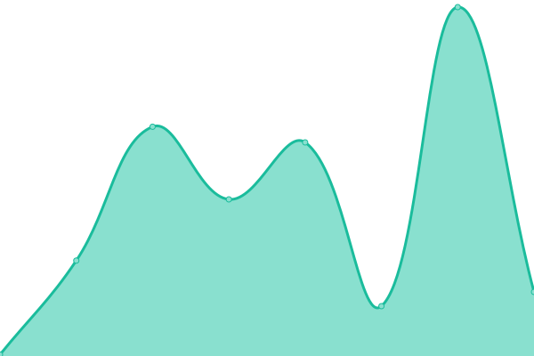
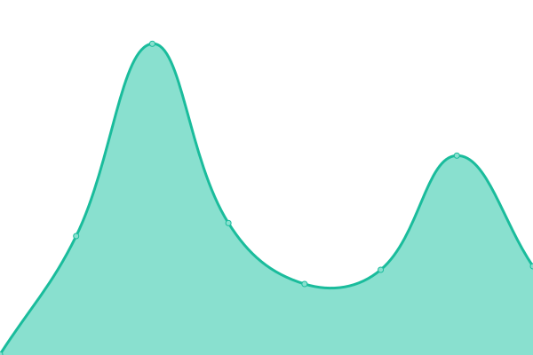
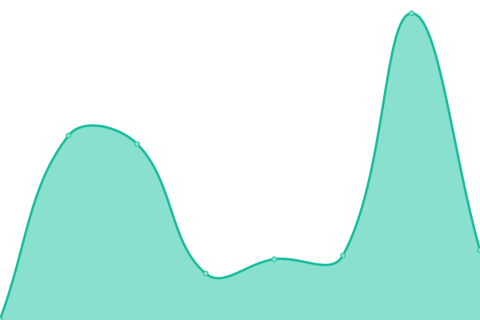

# [📈 Live Status](https://ersinesen.github.io/myupptime): <!--live status--> **🟩 All systems operational**

This repository contains the open-source uptime monitor and status page for [Ersin Esen](http://ersinesen.appspot.com), powered by [Upptime](https://github.com/upptime/upptime).

With [Upptime](https://upptime.js.org), you can get your own unlimited and free uptime monitor and status page, powered entirely by a GitHub repository. We use [Issues](https://github.com/ersinesen/myupptime/issues) as incident reports, [Actions](https://github.com/ersinesen/myupptime/actions) as uptime monitors, and [Pages](https://ersinesen.github.io/myupptime) for the status page.

<!--start: status pages-->
<!-- This summary is generated by Upptime (https://github.com/upptime/upptime) -->
<!-- Do not edit this manually, your changes will be overwritten -->
<!-- prettier-ignore -->
| URL | Status | History | Response Time | Uptime |
| --- | ------ | ------- | ------------- | ------ |
|  [Word Duel](https://wordle-duel.web.app/) | 🟩 Up | [word-duel.yml](https://github.com/ersinesen/myupptime/commits/HEAD/history/word-duel.yml) | 

 105ms
     
 | 

<a href="https://ersinesen.github.io/myupptime/history/word-duel">100.00%</a>
    

|  [Word Duel Backend](https://Wordle-Duel-Backend.ersinesen.repl.co) | 🟩 Up | [word-duel-backend.yml](https://github.com/ersinesen/myupptime/commits/HEAD/history/word-duel-backend.yml) | 

 187ms
     
 | 

<a href="https://ersinesen.github.io/myupptime/history/word-duel-backend">100.00%</a>
    

|  [Word Duel Türkçe](https://wordle-duello-56e98.web.app/) | 🟩 Up | [word-duel-tuerkce.yml](https://github.com/ersinesen/myupptime/commits/HEAD/history/word-duel-tuerkce.yml) | 

 94ms
     
 | 

<a href="https://ersinesen.github.io/myupptime/history/word-duel-tuerkce">100.00%</a>
    

|  [Word Duel Türkçe Backend](https://Wordle-Duello-Backend.ersinesen.repl.co) | 🟩 Up | [word-duel-tuerkce-backend.yml](https://github.com/ersinesen/myupptime/commits/HEAD/history/word-duel-tuerkce-backend.yml) | 

 226ms
     
 | 

<a href="https://ersinesen.github.io/myupptime/history/word-duel-tuerkce-backend">100.00%</a>
    

|  [Mazer](https://mazer.ersinesen.repl.co) | 🟩 Up | [mazer.yml](https://github.com/ersinesen/myupptime/commits/HEAD/history/mazer.yml) | 

 815ms
     
 | 

<a href="https://ersinesen.github.io/myupptime/history/mazer">100.00%</a>
    

|  [Home Page](https://ersinesen.appspot.com/) | 🟩 Up | [home-page.yml](https://github.com/ersinesen/myupptime/commits/HEAD/history/home-page.yml) | 

 79ms
     
 | 

<a href="https://ersinesen.github.io/myupptime/history/home-page">100.00%</a>
    

|  [Esenbil](https://www.esenbil.com/) | 🟩 Up | [esenbil.yml](https://github.com/ersinesen/myupptime/commits/HEAD/history/esenbil.yml) | 

 451ms
     
 | 

<a href="https://ersinesen.github.io/myupptime/history/esenbil">100.00%</a>
    

<!--end: status pages-->

[**Visit our status website →**](https://ersinesen.github.io/myupptime)

## 📄 License

- Powered by: [Upptime](https://github.com/upptime/upptime)
- Code: [MIT](./LICENSE) © [Ersin Esen](http://ersinesen.appspot.com)
- Data in the `./history` directory: [Open Database License](https://opendatacommons.org/licenses/odbl/1-0/)
